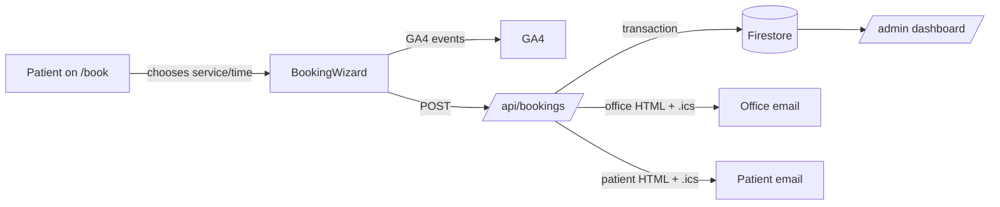

# Wellness Paris TX

Marketing and booking site for **The Rub Club Massage** and **Chiropractic Associates** — a
family-owned, dual-brand wellness practice serving **Paris, TX** (main office, both brands) and
**Sulphur Springs, TX** (chiropractic).

Built with Next.js 15 (App Router) + React 19 + Tailwind, backed by Firebase (Firestore + Admin
Auth) and SendGrid for transactional email.

---

## Quick start

Requirements: Node 18.18+ (Node 20 recommended), npm 10+.

```bash
npm install
cp env.example .env.local   # fill in the values you have; see table below
npm run dev
```

Open <http://localhost:3000>.

Other scripts:

- `npm run build` — production build
- `npm run start` — serve a production build
- `npm run lint` — ESLint on the app + components
- `npm run verify:massage-team` — checks Firestore `massage_team_members` rows: anonymous `HEAD` on each `photoUrl`, and that `photoStoragePath` objects exist under `public_site/massage_team/**` when present. Uses the same env as Next (`.env.local`). Exit code 1 if any portrait is not publicly reachable.

**Massage team portraits (superadmin):** uploads land in Storage at `public_site/massage_team/<FirestoreDocId>.<ext>` with `photoUrl` stored on the document. Deploy rules so visitors can read them: `firebase deploy --only storage` (see `storage.rules` → `public_site/**` read). Public “Meet the team” blocks live on `/` and `/services/massage` (scroll past the hero on the massage page).

---

## Environment variables

| Name | Required | Purpose |
|---|---|---|
| `FIREBASE_SERVICE_ACCOUNT_KEY` | Yes (server) | Admin SDK service account JSON for Firestore + Auth admin ops. |
| `NEXT_PUBLIC_FIREBASE_API_KEY` | Yes (client) | Web SDK config — staff sign-in only. |
| `NEXT_PUBLIC_FIREBASE_AUTH_DOMAIN` | Yes (client) | Must be allow-listed in Firebase Auth → Settings → Authorized domains. |
| `NEXT_PUBLIC_FIREBASE_PROJECT_ID` | Yes (client) | Web SDK config. |
| `NEXT_PUBLIC_FIREBASE_STORAGE_BUCKET` | Recommended | Exact `storageBucket` from Firebase web app config. Admin uploads use it when `FIREBASE_STORAGE_BUCKET` is unset; avoids wrong default bucket hostname. |
| `FIREBASE_STORAGE_BUCKET` | Optional | Overrides inferred Storage bucket on the server (use if your project still uses a legacy `*.appspot.com` default bucket). |
| `NEXT_PUBLIC_APP_URL` | Yes | Canonical site origin (no trailing slash). Drives `metadataBase`, OG, canonical, sitemap, and Firebase password-reset return links. |
| `SENDGRID_API_KEY` | Recommended | Enables booking confirmation, office notification, contact form, and staff-invite emails. |
| `SENDGRID_FROM_EMAIL` | Recommended | Verified Single Sender in SendGrid. Plain email only (no JSON, no quotes). |
| `OFFICE_NOTIFICATION_EMAIL` | Recommended | Where booking + contact-form notifications are sent. |
| `RATE_LIMIT_SALT` | Recommended | Rotate occasionally; hashes IPs for the booking rate limiter. |
| `ADMIN_BOOTSTRAP_SECRET` | Bootstrap only | Long random string used once to grant the first superadmin, then removed. |
| `NEXT_PUBLIC_GA_ID` | Optional | GA4 measurement ID (`G-XXXXXXXXXX`). When set, GA loads automatically. |
| `NEXT_PUBLIC_GTM_ID` | Optional | Google Tag Manager container ID (`GTM-XXXXXX`). |
| `NEXT_PUBLIC_GBP_PARIS_URL` | Optional | Google Business Profile review link (Paris). Used in `sameAs` and the reviews page. |
| `NEXT_PUBLIC_GBP_SS_URL` | Optional | Google Business Profile review link (Sulphur Springs). |
| `NEXT_PUBLIC_FACEBOOK_URL` | Optional | Facebook page URL — emitted in Organization JSON-LD. |
| `NEXT_PUBLIC_INSTAGRAM_URL` | Optional | Instagram profile URL — emitted in Organization JSON-LD. |
| `NEXT_PUBLIC_YELP_URL` | Optional | Yelp listing URL — emitted in Organization JSON-LD. |

All `NEXT_PUBLIC_*` variables are exposed to the browser bundle.

---

## Project structure

```
app/
  layout.tsx              # Root layout: metadata, skip link, JSON-LD, analytics
  page.tsx                # Home
  sitemap.ts              # XML sitemap (Next file convention)
  robots.ts               # robots.txt (Next file convention)
  manifest.ts             # PWA manifest
  icon.svg / apple-icon.svg
  book/                   # Booking wizard (server shell + client wizard)
  services/{massage,chiropractic}/
  locations/{paris,sulphur-springs}/
  contact/                # Contact form
  about/, faq/, insurance/, reviews/, patient-forms/
  auth/password-reset-complete/
  admin/                  # Staff portal (auth-gated)
  api/
    bookings/             # POST a public booking; sends patient + office emails with .ics
    providers/, slots/    # Public booking helpers
    contact/              # POST contact-form messages
    admin/                # Auth-gated admin endpoints

components/               # SiteHeader, SiteFooter, BookingWizard, FaqList, JsonLd, Analytics, etc.

lib/
  constants.ts            # Locations, hours, helpers
  site-content.ts         # Brand strings, env-driven origin and sameAs profiles
  structured-data.ts      # JSON-LD factories
  faqs.ts, testimonials.ts
  email-templates.ts      # Branded HTML for patient/office/contact emails
  ics.ts                  # RFC 5545 calendar attachment builder
  sendgrid.ts             # Thin SendGrid wrapper with attachment support
  firebase-admin.ts, providers-db.ts, slots-luxon.ts, rate-limit.ts
  home-verbatim.ts, home-images.ts
```

---

## Booking flow



- The wizard accepts `?location=`, `?service=`, `?duration=`, `?date=` deep-link query params.
- Slot grid is mobile-first (2 cols), keyboard-accessible, with aria-live updates.
- On a 409 (slot just taken) the wizard auto-refreshes openings.
- Both emails include an `.ics` calendar attachment so the patient and office can add the
  appointment to Apple/Google/Outlook in one tap.

---

## Bootstrap a superadmin (one-time)

1. Set `ADMIN_BOOTSTRAP_SECRET` to a long random string and deploy.
2. Sign in via `/admin/login` with the staff Firebase Auth account that should be promoted.
3. POST `/api/admin/bootstrap` with header `x-bootstrap-secret: <secret>` and a JSON body
   matching the route's expectations.
4. Remove `ADMIN_BOOTSTRAP_SECRET` from your environment.
5. New staff are added via `/admin/super` (invite email link generation goes through SendGrid).

**Staff roles migration (existing projects):** If any `staff/{uid}` documents still have
`role: "admin"`, run once after deploy (dry run first):

```bash
npx tsx scripts/migrate-staff-roles.ts
npx tsx scripts/migrate-staff-roles.ts --apply
```

Roles are `massage_therapist`, `front_desk`, `manager`, and `superadmin`. Legacy `admin` is
still accepted at read time as `front_desk` until migrated.

---

## SEO checklist (after deploy)

- [ ] Verify the live site with [Google Search Console](https://search.google.com/search-console).
- [ ] Submit `https://YOUR_DOMAIN/sitemap.xml` in Search Console.
- [ ] Test JSON-LD with the [Rich Results Test](https://search.google.com/test/rich-results).
- [ ] Claim both Google Business Profile listings (Paris + Sulphur Springs) and add the
      review URLs to `NEXT_PUBLIC_GBP_*` env vars.
- [ ] Verify `metadataBase` (set `NEXT_PUBLIC_APP_URL` in production).
- [ ] Set `NEXT_PUBLIC_GA_ID` so funnel events from `BookingWizard` flow into GA4.

---

## Deploy on Vercel

This site is designed for Vercel deployment.

1. Push the repo to GitHub.
2. Create a Vercel project pointing at this repo.
3. Add the env vars from the table above (mark `NEXT_PUBLIC_*` as exposed to the browser).
4. Add the production domain to **Firebase Auth → Settings → Authorized domains**.
5. After first successful deploy, run the bootstrap step to grant the first superadmin.
